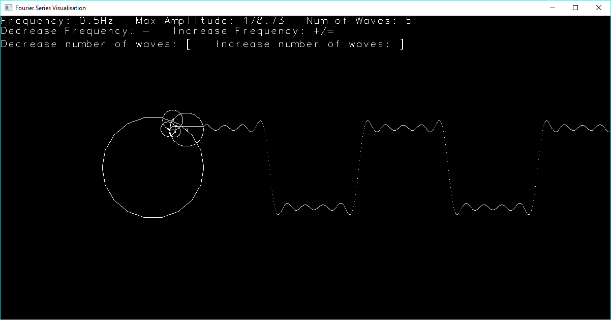

Fourier Series Visualisation
============================
## Overview
This program adds sine waves together to form a square wave using the fourier series. The visualisation is made up of many circles which combine to trace a single wave pattern which approximates a square wave. Each circle or 'wheel' represents a singular sine wave with its radius being the wave's amplitude and the frequency of rotation being the wave's frequency.

## Controls
The wave produced in the program can be adjusted by changing the number of wheels or the frequency of rotation of the wheels. This can be done using the following:
* `-` Decreases frequency
* `+` Increases frequency
* `[` Decreases number of waves
* `]` Increases number of waves

The more waves there are in the visualisation, the more accurate the approximation of the square wave.

## Screenshots

## Flexibility
The program is designed so that the circle class can be used easily to create other wave forms, but this functionality is only available by reprogramming before runtime rather than using runtime controls. However, the structure of the program makes it easy to do and there is a simple example commented out.
